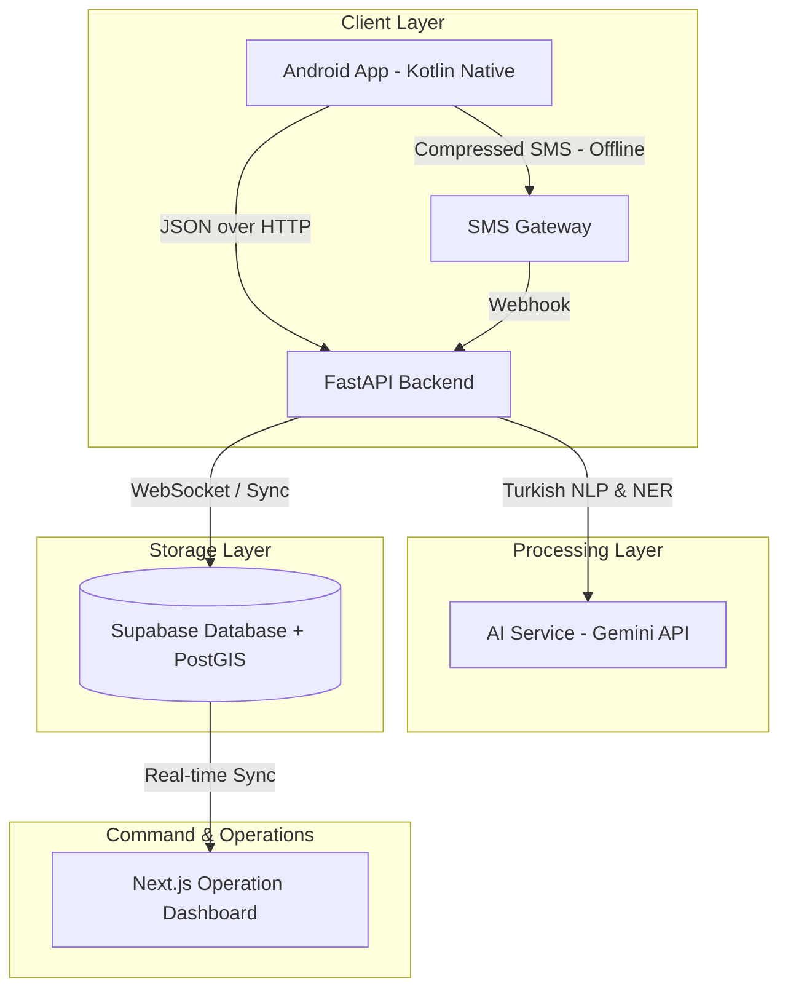

# AFETSOS: AI-Powered Emergency Communication & Decision Support Platform

<p align="center">
  
  
  
  
  
  
</p>

**AFETSOS** is a comprehensive, AI-powered emergency communication and decision support platform designed to streamline rescue coordination during high-density natural disasters (such as earthquakes). Developed for the **INOFEST** competition by a team of Computer Engineering students from **İnönü University**, AFETSOS processes unstructured Turkish distress calls—textual or voice-based—in real-time and converts them into structured, prioritized operational data for emergency responders.

---

## 🔍 Core Problem & Our Solution

### The Problem
During massive crisis scenarios, emergency centers are overwhelmed with a chaotic inflow of distress messages from social media and direct channels. These messages are often:
- **Unstructured and Panic-driven:** Lacking explicit coordinate names, proper address formatting, or clear urgency indexes.
- **Priority-Blind:** Life-threatening emergencies get buried beneath low-priority queries.
- **Connectivity-Dependent:** Standard emergency platforms stop working entirely when internet infrastructures collapse.

### Our Solution
AFETSOS bridges the gap between chaotic survivor calls and organized rescue teams through a four-stage hybrid pipeline:
1. **Survivors' Input:** Survivors send text or voice distress calls via a simplified mobile interface. High-precision GPS is automatically attached.
2. **AI & NLP Analysis:** The backend server uses Natural Language Processing (NLP) models to automatically extract **Urgency Levels**, **Need Types** (e.g., medical, fire, entrapment), and **Address/Location** entities from the raw Turkish text.
3. **Hybrid Communication (Offline Fallback):** If standard internet connections fail, the mobile app compresses the distress data and sends it via **SMS**. An automated SMS Gateway reads the incoming SMS messages and instantly streams them to the central system via webhooks.
4. **Real-time Clustered Command Dashboard:** Cases are instantly visualized on a map dashboard with spatial clustering (using PostGIS), helping rescue teams identify the highest concentration of critical incidents in real-time.

---

## 🏗️ System Architecture



### 📱 1. Mobile Application (`/android_app`)
- **Native Android Development:** Developed in Kotlin.
- **Crisis-Centered UI/UX:** High-contrast color palette, simple big buttons, and distraction-free design optimized for panicked survivors, low light conditions, and single-handed use.
- **Intelligent Features:** Speech-to-Text conversion for voice messages, high-accuracy GPS capture, battery-saving location polling, and automated offline SMS redirection.

### ⚙️ 2. Backend API (`/backend`)
- **High-Performance Web Server:** Built on Python and FastAPI with fully asynchronous handlers.
- **AI Processing Engine:** Connects to state-of-the-art Natural Language Processing tools to perform Named Entity Recognition (NER) and urgency classification on Turkish distress texts.
- **SMS Gateway Integration:** Handles incoming SMS notifications from mobile clients, unpacks coordinates and distress parameters, and saves them directly to the database.

### 📊 3. Operational Dashboard (`/dashboard`)
- **Modern Web Architecture:** Built using Next.js, React, TailwindCSS, and TypeScript.
- **Map-based Control Panel:** Leverages Leaflet maps to group and visualize emergency signals.
- **Spatial Clustering:** Implements real-time spatial clustering so hundreds of scattered calls on the same block are grouped into single actionable hot-spots for rescue forces.
- **Live Stream:** Displays a chronological, color-coded urgency feed of incoming alerts with direct team-dispatch actions.

---

## 🛠️ Installation & Local Setup

Since this repository contains the clean codebase ready for deployment, dependencies can be set up in a few simple commands.

### 1. Backend Setup
1. Navigate to the backend directory:
   ```bash
   cd backend
   ```
2. Create and activate a Python virtual environment:
   ```bash
   python -m venv .venv
   # On Windows:
   .venv\Scripts\activate
   # On macOS/Linux:
   source .venv/bin/activate
   ```
3. Install dependencies:
   ```bash
   pip install -r requirements.txt
   ```
4. Copy the environment variables template and configure your keys:
   ```bash
   cp .env.example .env
   ```
   *Edit `.env` and fill in your `SUPABASE_URL`, `SUPABASE_KEY` (anon public), and `GEMINI_API_KEY`.*
5. Run the FastAPI development server:
   ```bash
   uvicorn main:app --reload
   ```

### 2. Dashboard Setup
1. Navigate to the dashboard directory:
   ```bash
   cd dashboard
   ```
2. Install npm packages:
   ```bash
   npm install
   ```
3. Copy the environment variables template and configure your keys:
   ```bash
   cp .env.example .env.local
   ```
   *Edit `.env.local` and add your `NEXT_PUBLIC_SUPABASE_URL` and `NEXT_PUBLIC_SUPABASE_ANON_KEY`.*
4. Start the Next.js development server:
   ```bash
   npm run dev
   ```

### 3. Android Mobile Application Setup
1. Open the `/android_app` folder in **Android Studio**.
2. Create a `local.properties` file in the root of the `android_app` folder if it doesn't exist, and specify your Android SDK path:
   ```properties
   sdk.dir=C\:\\Users\\YOUR_PC_USER\\AppData\\Local\\Android\\Sdk
   ```
3. Build the project and deploy the APK to your test device or emulator.

---

## 👥 The Project Team

* **Hüseyin POLAT** - Team Captain & Lead Mobile Developer (Computer Engineering, İnönü University)
  * *Responsibilities:* Kotlin Native Android application development, UI/UX design, GPS tracking, and front-end integration.
* **Levent AYDIN** - Backend Developer & AI Engineer (Computer Engineering, İnönü University)
  * *Responsibilities:* Asynchronous FastAPI backend architecture, Natural Language Processing integrations, database schema, and SMS Gateway Webhooks.
* **Doç. Dr. Cengiz HARK** - Academic Advisor (Assoc. Prof., Computer Engineering Department, İnönü University)
  * *Responsibilities:* Academic supervision, methodology definition, and scientific validation of NLP frameworks.

---
*Developed with dedication for INOFEST 2026.*
